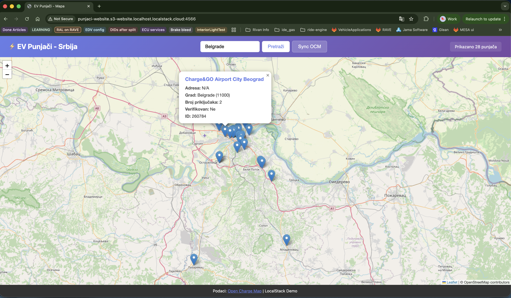

# Lambda + Web Frontend - Dopuna za Finalni Projekat

Ovaj folder sadrži dopunu za finalni projekat koja dodaje **web frontend sa mapom** i **Lambda funkciju za preuzimanje punjača po gradu**.

## Struktura

- `index.js` - Lambda funkcija koja query-uje DynamoDB po gradu (koristi GSI TownIndex)
- `web/index.html` - Frontend sa Leaflet mapom za prikaz punjača

### O Leaflet i OpenStreetMap

**Leaflet** je open-source JavaScript biblioteka za interaktivne mape. Koristi se za:
- Prikazivanje markera na mapi (punjači)
- Zoom i pan funkcionalnosti
- Popup prozore sa detaljima

**OpenStreetMap (OSM)** je besplatna, open-source mapa sveta (alternativa Google Maps-u). Leaflet koristi OSM tile servere za učitavanje mapa - tile-ovi se učitavaju sa `tile.openstreetmap.org` CDN-a.

U ovom projektu, Leaflet prikazuje mapu Srbije i postavlja markere na lokacije punjača (koristeći lat/long koordinate iz DynamoDB).

## Podešavanje

### 1. Dodaj Lambda funkciju u `serverless.yml`

U postojeći `serverless.yml` fajl (iz nekog od prethodnih nedelja), dodaj novu funkciju:

```yaml
functions:
  # ... postojeće funkcije ...
  
  getChargersByTown:                 # Lambda za preuzimanje punjača po gradu
  ...
  ...
  ...
```

### 3. Ažuriraj API Gateway ID u frontendu

Nakon deploy-a, ažuriraj `web/index.html`:

## Pokretanje aplikacije

### 1. Zaustavi postojeće kontejnere (opciono, ako ima nekih)

```bash
docker-compose down -v
```

### 2. Pokreni LocalStack

```bash
docker-compose up -d
```

Sačekaj ~5 sekundi da se LocalStack potpuno pokrene.

### 3. Deploy Serverless infrastrukture

```bash
npx serverless deploy
```

### 4. Deploy frontend na S3

```bash
npm run deploy-frontend-fixed-bucket
```

**Napomena:** Pre deploy-a frontenda, ažuriraj `API_ID` u `web/index.html`.

## Pristup aplikaciji

Aplikacija će trčati na:

**http://punjaci-website.s3-website.localhost.localstack.cloud:4566/**

### Primer aplikacije



### Funkcionalnosti:

- ✅ **Mapa** - Prikaz punjača na interaktivnoj mapi (Leaflet)
- ✅ **Pretraga po gradu** - Unesi naziv grada i prikaži sve punjače
- ✅ **Detalji punjača** - Klik na marker prikazuje detalje (adresa, broj priključaka, itd.)
- ✅ **Sync OCM** - Dugme za sinhronizaciju podataka sa Open Charge Map API-ja

## API Endpoints

- `GET /chargers/{town}` - Preuzmi punjače za određeni grad
  - Primer: `/chargers/Belgrade`
  - Vraća JSON sa listom punjača (lat, long, adresa, itd.)

- `GET /sync` - Sinhronizuj podatke sa OCM API-ja (iz glavnog projekta)

## Muka i panika

### CORS greške

Proveri da li lambda funkcija ima ispravan `ALLOWED_ORIGIN`:
```javascript
const ALLOWED_ORIGIN = 'http://punjaci-website.s3-website.localhost.localstack.cloud:4566';
```

### API Gateway ID je "None"

```bash
# Proveri da li API Gateway postoji
# Ako je prazno, redeploy serverless resurse
# Zatim ažuriraj frontend
```

### Mapa se ne učitava

- Proveri internet konekciju (Leaflet učitava tile-ove sa OpenStreetMap CDN-a)
- Otvori browser konzolu za detalje greške

## Napomene

- **API Gateway ID** se menja svaki put kada se LocalStack restartuje sa `-v` flagom
- U produkciji bi se koristio **custom domain** umesto random API Gateway ID-a
