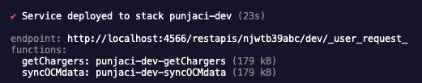
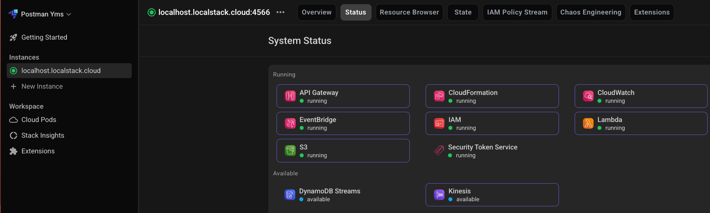

# Project Setup and Deployment Instructions

## Prerequisites

- Docker and Docker Compose installed
- Node.js and npm installed

## 1. Clean Up Docker Environment

Before starting, clean up the existing LocalStack container if it's running:

```bash
# Find the LocalStack container ID
docker ps -a

# Stop the specific LocalStack container (replace CONTAINER_ID with actual ID)
docker stop CONTAINER_ID

# Remove the specific container
docker rm CONTAINER_ID

```

## 2. Start LocalStack with Docker Compose

Run LocalStack to simulate AWS services locally:

```bash
# Start LocalStack in detached mode
docker-compose up

# Verify LocalStack is running
docker ps

```

If `docker-compose` command is not found try `docker compose`.

LocalStack will be available at `http://localhost:4566`

## 3. Deploy Serverless Configuration

Deploy your serverless functions to LocalStack:

```bash
# Install serverless dependencies
npm install

# Deploy to LocalStack
npx serverless deploy
```

This will deploy your Lambda functions, API Gateway, and other AWS resources to LocalStack.

## 4. Deploy Static Site to S3

Upload your static website files to the S3 bucket:

```bash
# Sync static files to S3 bucket
awslocal s3 sync ./web s3://punjaci-website
```

## 5. Access Your Application

- **API Endpoints**: Check the serverless deploy output for API Gateway URLs
  

  - use `endpoint` url and add a path for your function, e.g `/chargers`
  - Example: [http://localhost:4566/restapis/njwtb39abc/dev/_user_request_/chargers](http://localhost:4566/restapis/njwtb39abc/dev/_user_request_/chargers)

- **S3 Website**: [http://punjaci-website.s3-website.localhost.localstack.cloud:4566](http://punjaci-website.s3-website.localhost.localstack.cloud:4566)

## 6.(Optional) Sign in to Localstack website to access Localstack UI

- [https://app.localstack.cloud/sign-in](https://app.localstack.cloud/sign-in)
- Click on available instance on the left, and select `Status` tab to see running services
  
